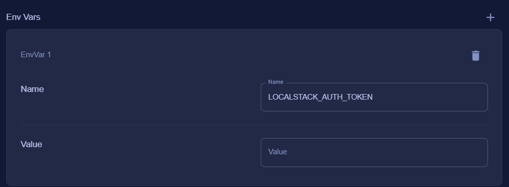

# 🏥 Patient Service Platform (Microservice Architecture)

This is a project built to explore microservices architecture using Spring Boot, Kafka, gRPC, and Docker. It simulates a simple healthcare backend with authentication, billing, analytics, and an API gateway.

---

## 🧩 Services Overview

| Service                | Description                                                                                                                                                                                  | Port               | Environment variables                                                                                                                                                                                                                                                                                                                                                                                                                         | Run options        |
|------------------------|----------------------------------------------------------------------------------------------------------------------------------------------------------------------------------------------|--------------------|-----------------------------------------------------------------------------------------------------------------------------------------------------------------------------------------------------------------------------------------------------------------------------------------------------------------------------------------------------------------------------------------------------------------------------------------------|--------------------|
| **patient-service**    | Main service for storing and managing patient data (uses `data.sql`)                                                                                                                         | 4000               | BILLING_SERVICE_ADDRESS=billing-service<br>BILLING_SERVICE_PORT=9001<br>SPRING_DATASOURCE_PASSWORD=password<br>SPRING_DATASOURCE_URL=jdbc:postgresql://patient-service-db:5432/db<br>SPRING_DATASOURCE_USERNAME=admin_user<br>SPRING_JPA_HIBERNATE_DDL_AUTO=update<br>SPRING_KAFKA_BOOTSTRAP_SERVERS=kafka:9092<br>SPRING_SQL_INIT_MODE=always                                                                                                | --network internal |
| **auth-service**       | Handles authentication and authorization using Spring Security and JWT                                                                                                                       | 4005               | JWT_SECRET="JWT_TOKEN"<br>SPRING_DATASOURCE_PASSWORD=password<br>SPRING_DATASOURCE_URL=jdbc:postgresql://auth-service-db:5432/db<br>SPRING_DATASOURCE_USERNAME=admin_user<br>SPRING_JPA_HIBERNATE_DDL_AUTO=update<br>SPRING_SQL_INIT_MODE=always                                                                                                                                                                                              | --network internal |
| **analytics-service**  | Listens to Kafka events (via a consumer), purpose: event-based processing                                                                                                                    | 4002               | SPRING_KAFKA_BOOTSTRAP_SERVERS=kafka:9092                                                                                                                                                                                                                                                                                                                                                                                                     | --network internal |
| **billing-service**    | Exposes a gRPC service to manage billing and communicate with other services                                                                                                                 | 4001, 9001 on gRPC |                                                                                                                                                                                                                                                                                                                                                                                                                                               | --network internal |
| **api-gateway**        | Entry point for all requests, includes JWT validation via custom filter that calls /validate in auth-service before routing requests.                                                        | 4004               | AUTH_SERVICE_URL=http://auth-service:4005                                                                                                                                                                                                                                                                                                                                                                                                     | --network internal |
| **auth-service-db**    | PostgreSQL database used by `auth-service` for storing user credentials, roles, and authentication-related data.                                                                             | 5001               | POSTGRES_DB=db<br>POSTGRES_PASSWORD=password<br>POSTGRES_USER=admin_user                                                                                                                                                                                                                                                                                                                                                                      | --network internal |
| **patient-service-db** | PostgreSQL database used by `patient-service` to store patient-related data, such as records, profiles, etc.                                                                                 | 5000               | POSTGRES_DB=db<br>POSTGRES_PASSWORD=password<br>POSTGRES_USER=admin_user                                                                                                                                                                                                                                                                                                                                                                      | --network internal |
| **kafka**              | Kafka is used to stream events from `patient-service` to `analytics-service`. The `patient-service` acts as the producer, and `analytics-service` consumes the topic for further processing. | 9092, 9094         | KAFKA_CFG_ADVERTISED_LISTENERS=PLAINTEXT://kafka:9092,EXTERNAL://localhost:9094<br>KAFKA_CFG_CONTROLLER_LISTENER_NAMES=CONTROLLER<br>KAFKA_CFG_CONTROLLER_QUORUM_VOTERS=0@kafka:9093<br>KAFKA_CFG_LISTENER_SECURITY_PROTOCOL_MAP=CONTROLLER:PLAINTEXT,EXTERNAL:PLAINTEXT,PLAINTEXT:PLAINTEXT<br>KAFKA_CFG_LISTENERS=PLAINTEXT://:9092,CONTROLLER://:9093,EXTERNAL://:9094<br>KAFKA_CFG_NODE_ID=0<br>KAFKA_CFG_PROCESS_ROLES=controller,broker | --network internal |

---
### ⚠️ Example values only. Use secure, environment-specific credentials.


## 🔧 Stack

- Java 17
- Spring Boot 3.5.0
- Spring Security (JWT)
- Apache Kafka
- gRPC (Java implementation)
- Docker
- LocalStack (for AWS mock services)

---

## 🚀 Getting Started

### Prerequisites
- Java 17
- Docker 
- LocalStack
- AWS CLI


## ⚙️ How to make it work?
### Clone.
```
git clone https://github.com/ramordeeple/patient-management.git
cd patient-service
```

### Ensure Docker Desktop and LocalStack are working on correctly.
1. Open docker desktop and be sure that its engine is working
<br>
<br>
2. Open and sign in LocalStack Desktop app.
3. In your profile in Auth tokens copy the personal auth-token.
4. In desktop LocalStack click on `Launch New LocalStack Container`.
5. You will see a window and all what need you to do there, is give a name to the localstack container and paste auth-token into Env Vars where `Value` is. And just press `Create` button.
<br>
6. Ensure container is running correctly with green dot mark. Otherwise try to turn off VPNs.
<br>

### Engage with the dockerfiles
1. Build each docker image from service modules by choosing them in `Run / Debug configuration` and clicking on  button. Make it with all dockerfiles from `Services Overview` with related ports and environment variables.
2. 


